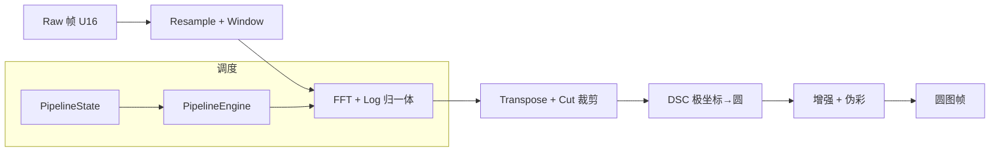

# Week15 / Day01 — 学习记录（源码填充版）

> 主题：消灭 P0 缺口——把 16 周笔记落成 OCTCudaProject 源码 + 脱敏架构图。

## 1. 现状盘点（实测，2026 本机）
`OCTCudaProject/OCTCudaCmake/`：
- include/oct：仅 `context.hpp / shape.hpp`（Context 记账 + Shape 尺寸，W12/13 骨架）；
- src/host：`context.cpp / cuda_utils.hpp / main.cpp`；**src/kernels 为空**；
- bench/、tests/、docs/ 各只有占位 Note.md；out/ 有构建产物（说明 CMake 曾成功编译）。
→ P0 其余模块全部待落。

## 2. P0 落位清单（Week15 执行表，文件名对齐 02 §5 模块表）
| P0 | 新增头 | 新增源 | 复用/注意 |
| --- | --- | --- | --- |
| Resampling+Window | oct/resample_window.hpp | src/kernels/resample_window.cu | W02D2/3；窗表 host 生成后传 const |
| FFT+Log | oct/fftlog.hpp | src/host/fftlog.cpp + cufft | W03D1/2；cuFFT plan 在 Context 里建 |
| Transpose+Crop | oct/transpose_crop.hpp | src/kernels/transpose_crop.cu | W04D1/2；cut 数组 per-frame |
| DSC | oct/dsc.hpp | src/kernels/dsc.cu | W04D3/4；v1 像素循环 / v2 行内插 |
| Enhancement+Color | oct/enhance_color.hpp | src/host/enhance_color.cpp | W05D1/2 |
| e2e Scan 帧 | oct/e2e.hpp | src/host/e2e.cpp | 编排以上 stage + W13 PipelineState |
| Pullback batch | oct/pullback_batch.hpp | src/host/pullback_batch.cpp | W06；走状态机 PullbackBulk |
| Calib(简化) | oct/calib.hpp | src/host/calib.cpp | W07D3 cpu_catheter_peak |
| Detect(简化) | oct/detect.hpp | src/host/detect.cpp | W08D1-3 三检测 |
| Stitch+ContCalib(简化) | oct/stitch_cont_calib.hpp | src/host/stitch_cont_calib.cpp | W09 rolling stitch |
| IPA calc/update | oct/ipa.hpp | src/host/ipa.cpp + kernel | W11D2/D3、W12D3；README 免责(W15D4) |
| Streams frame pipe | oct/e2e.hpp 内 framepipe | src/host/framepipe.cu | W13D3 双流 |
> tests/bench 每模块加一个合成用例（各周 DoD 即验收断言）。

## 3. 架构图（脱敏 chain A，可直接进 README）

（只画功能与数据流，不含内部常数/宿主路径——合规 00 §7。）

## 4. 提交整理（动手）
```
README.md          ← 架构图 + 三行安装/运行
docs/perf.md        ← W15D2
docs/precision.md   ← W15D3
tests/             ← 各模块 GTest
bench/             ← perf 原始终端输出归档
```
建议 git 仓库内只用功能名（不出现“公司仓/DLL 全名”），提交信息按模块拆分。

## 5. DoD 打卡
- [ ] P0 全部有头+实现+合成测试；无红项
- [x] README 架构图文本（§3）可复用

## 明日预告
docs/perf.md：stage ms / fps / CPU 对比 / DSC v1-v2 性能表。
